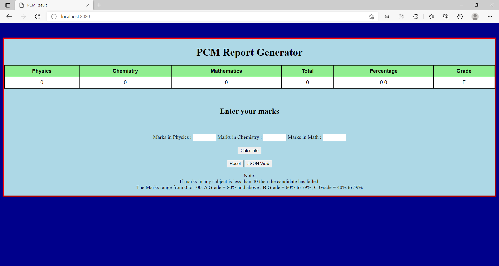
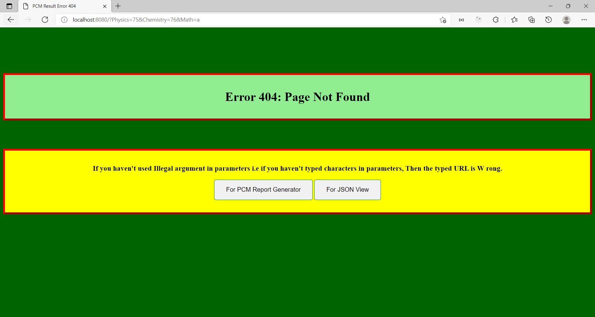
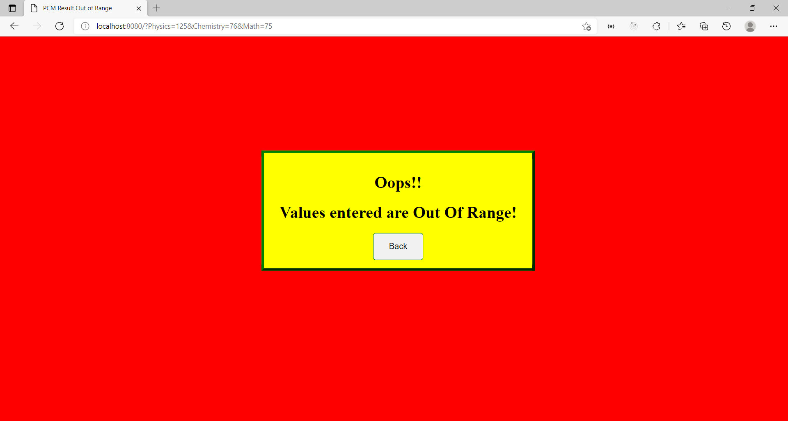
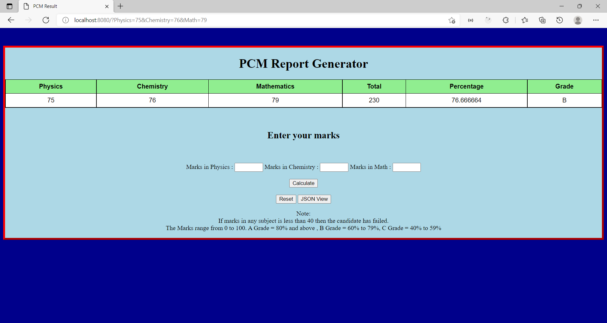
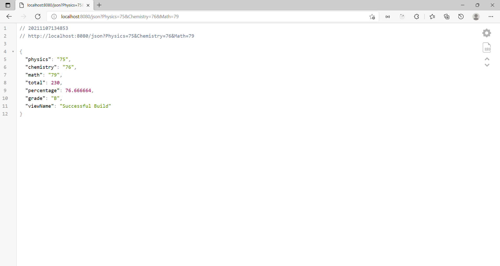

# PCM Report Generator
This is a PCM Report Card Generator which uses Springboot Framework and runs on Java Eclipse IDE. 
It displays Physics ,Chemistry and Maths marks along with the combined total, percentage and grade. 
The marks range for each subject is from 0 to 100.If any subject marks is less than 40 then the candidate has failed 
The Grading Table
<table>
    <tr>
        <th>Grade</th>
        <th>Percentage</th>
    </tr>
    <tr>
        <td>A</td>
        <td>80 and above</td>
    </tr>
    <tr>
        <td>B</td>
        <td>60 to 79</td>
    </tr>
    <tr>
        <td>C</td>
        <td>40 to 59</td>
    </tr>
</table>

<h3>Features</h3>
1. You can enter your marks in the section provided.  
2. Alternatively you can put marks in url  
eg.: http://localhost:8080/json?Physics=75&Chemistry=76&Math=75 or http://localhost:8080/?Physics=75&Chemistry=76&Math=75  
3. Click on Reset to reset the system.  
4. Click on JSON view to view the json view  

<h3>Requirements</h3>
1. Java jdk-15 
2. Eclipse IDE for Java Developers 2021-06  
3. Maven Dependencies from 2021-06 - https://download.eclipse.org/releases/2021-06/ (if it's not already installed) 
4. JSON Viewer (optional) 

<h3>Steps to Run</h3>
1. Right click on PCMApp.java  
2. Run it as Java Application  
3. Note the port number on which Tomcat server is started  
4. Enter the url as mentioned above with the appropriate port no.  

## Images of the Project
Main Page

Wrong URL and Character in Value of Parameter Occurence Error Page

Out of Range Value of Parameter Error Page

HTML View of Result

JSON View of Result
